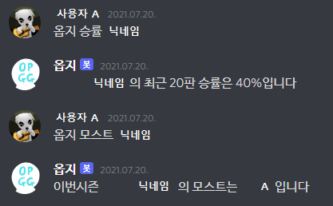

# OPGGBot
Discord bot that gets user information from [OPGG](https://www.op.gg/)

## Process
1. Type the command and user name using the discord message.
2. OPGGBot parses the specific information from [OPGG](https://www.op.gg/).
3. OPGGBot prints corresponding information using a discord message.

## Usage
- 옵지 승률 {user_name}: print winning percentage of user_name
- 옵지 모스트 {user_name}: print most used champion of user_name
- 옵지 나가: log out

## Example

